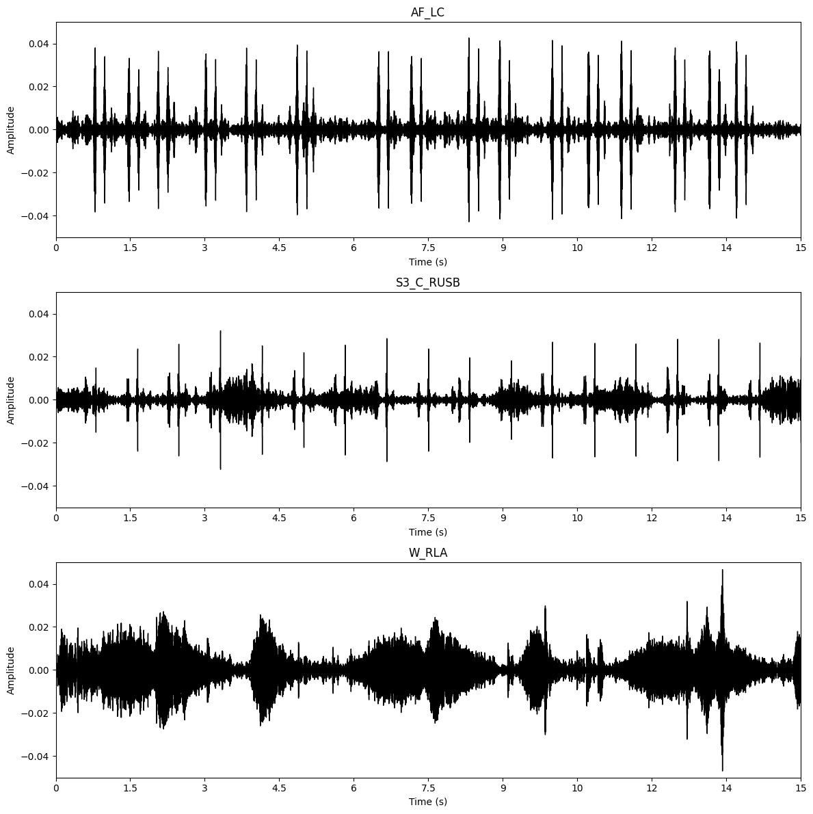
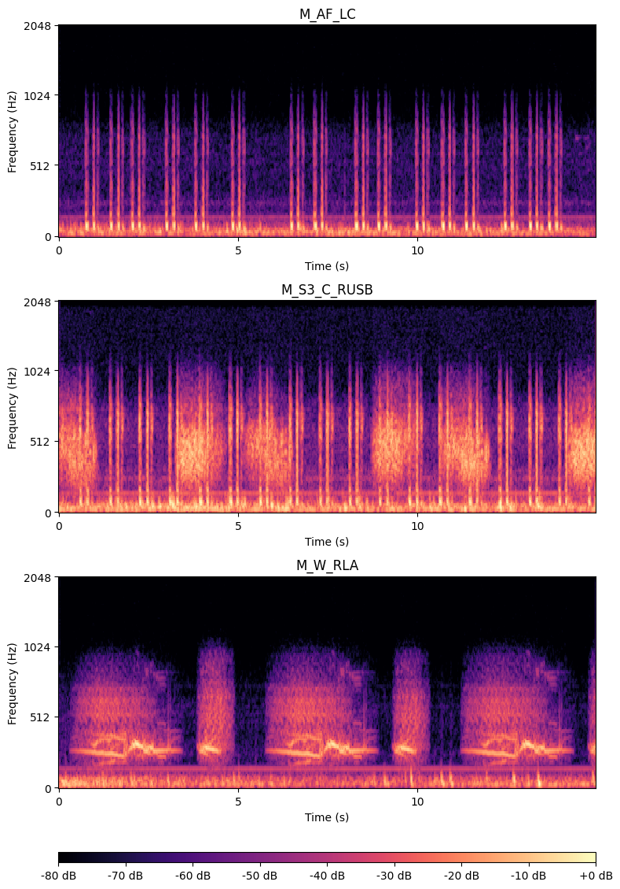
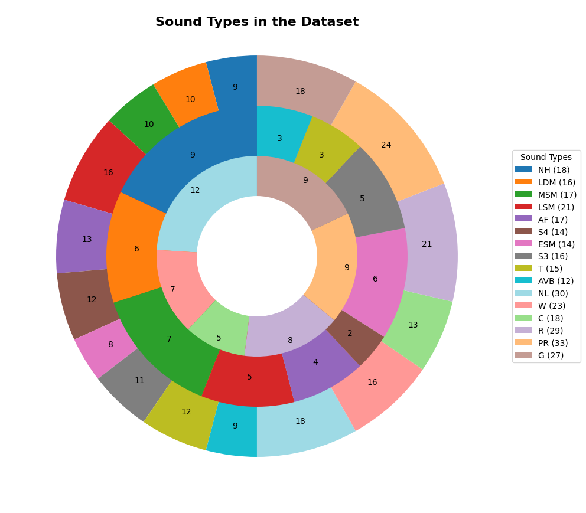

# Heart and Lung Sounds Dataset Recorded from a Clinical Manikin using Digital Stethoscope (HLS-CMDS)

**For more details, including collection methods and technical information, please visit:**

- **Mendeley Data DOI**: https://doi.org/10.17632/8972jxbpmp.1
- **Dataset Paper DOI**: [Insert Dataset Paper DOI Here](https://doi.org/InsertDatasetPaperDOI)

## About the Dataset

This dataset contains 210 recordings of heart and lung sounds captured using a digital stethoscope from a clinical manikin, including both individual and mixed recordings of heart and lung sounds; 50 heart sounds, 50 lung sounds, and 110 mixed sounds. It includes recordings from different anatomical chest locations, with normal and abnormal sounds. Each recording has been filtered to highlight specific sound types, making it valuable for artificial intelligence (AI) research and applications in areas such as automated cardiopulmonary disease detection, sound classification, and deep learning algorithms related to audio signal processing.

- **Recording Sources:** Heart and lung sounds captured from a clinical manikin simulating real physiological conditions.
- **Data Type:** Audio files (.wav format)
- **Sound Types:** Normal Heart, Late Diastolic Murmur, Mid Systolic Murmur, Late Systolic Murmur, Atrial Fibrillation, Fourth Heart Sound, Early Systolic Murmur, Third Heart Sound, Tachycardia, Atrioventricular Block, Normal Lung, Wheezing, Crackles, Rhonchi, Pleural Rub, and Gurgling.
- **Auscultation Landmarks:** Right Upper Sternal Border, Left Upper Sternal Border, Lower Left Sternal Border, Right Costal Margin, Left Costal Margin, Apex, Right Upper Anterior, Left Upper Anterior, Right Mid Anterior, Left Mid Anterior, Right Lower Anterior, and Left Lower Anterior.
- **Applications:** AI-based cardiopulmonary disease detection, unsupervised sound separation techniques, deep learning for audio signal processing.

## About the Code

This repository includes Python scripts designed to work with the **Heart and Lung Sounds Dataset (HLS-CMDS)**. The provided code helps visualize and analyze the audio signals in different ways. Below are the main features of the code:

- **Signal Visualization in Time Domain (`Audio_plotter.py`):** 
  This code provides tools to load and visualize heart and lung sounds as time-domain waveforms, giving a clear representation of the amplitude variations over time.

- **Time-Frequency Mel Spectrogram Plotting (`Audio_spectogram.py`):** 
  The code includes functionality to compute and visualize Mel spectrograms, which represent the frequency content of the heart and lung sounds over time, providing insights into the sound’s spectral properties.

- **Demographic Information Visualization (`Donut_chart.py`):** 
  Additionally, the code supports the visualization of demographic data related to the dataset, including the anatomical locations where the sounds were recorded. This helps users understand the dataset’s distribution across different recording locations and sound types.

### Key Libraries Used:
- `librosa` for audio processing and visualization
- `matplotlib` for plotting waveforms and spectrograms
- `numpy` for data manipulation and mathematical operations

## Acknowledgment

We would like to acknowledge the Mohawk Institute for Applied Health Sciences (IAHS) for their assistance in data collection using the patient simulators.

## Citation:
If you use this code or the associated dataset in your research, please cite the following:
- Torabi, Yasaman; Shirani, Shahram; Reilly, James P. (2024),
“HLS-CMDS: Heart and Lung Sounds Dataset Recorded from a Clinical Manikin using Digital Stethoscope”,
Mendeley Data, V1, https://doi.org/10.17632/8972jxbpmp.1

- Dataset Article: [INSERT Article DOI HERE].

© 2024 by Yasaman Torabi. All rights reserved.

